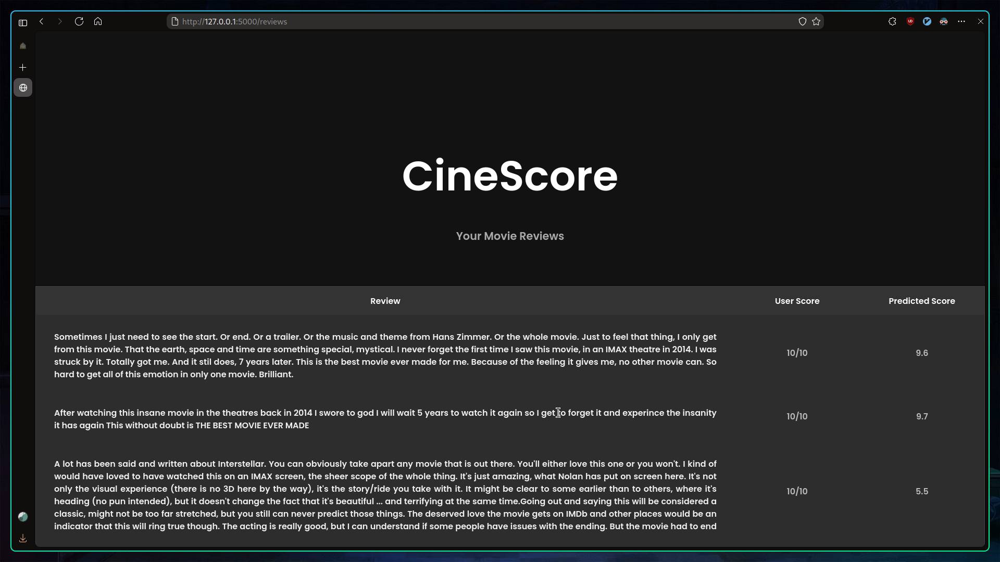

<h1 style="font-size:3rem;" align="center">🎬 CineScore</h1>

<br>


| Home | Suggestions |
|---------|---------|
|  |  |
| Review1 | Review 2 |
|  |  |

<br>
# 📝 Project Overview

This project (assignment) is a Flask-based web application that combines **LSTM-based sentiment analysis** and **IMDb web scraping** to provide a platform where users can:
1. Search for movies on IMDb database on a text input (e.g., movie name or keyword).
2. View a list of movie options with images fetched from their official IMDb pages.
3. Select a movie and view its user reviews along with ratings.
4. See predicted sentiment scores based on a trained **LSTM model** for each review.

The app scrapes official IMDb user reviews and computes sentiment scores for each review using a pre-trained LSTM model. It then displays the reviews, user scores, and predicted scores in a table.


<br>


# 🌟 Features

- **Movie Search**: Users can input a movie or keyword, and the app will search IMDb for relevant movies.
- **Image Scraping**: The app scrapes movie images from the official IMDb webpage.
- **Review Scraping**: User reviews are scraped from IMDb's official review page.
- **Sentiment Prediction**: The app uses a pre-trained LSTM model to predict sentiment scores for each review.
- **Table of Results**: Display of movie reviews, IMDb user scores and predicted sentiment scores in an organized table.

<br>


# 💻 Installation

1. **Clone the Repository**:

```bash
git clone https://github.com/your-username/movie-sentiment-analysis-flask.git
cd movie-sentiment-analysis-flask
```
   
2. **Create a Virtual Environment (optional but recommended)**:

```bash
python3 -m venv venv
source venv/bin/activate
```

3. **Installation**:

```bash
pip install -r requirements.txt
```

<br>

# 🚀 Running the App


To start the Flask server, run the following command:

```bash
python app.py
```

<br>

## 📚 Datasets and Resources


### 1. **IMDB Dataset for Sentiment Analysis**

- **Description**: The IMDB dataset contains movie reviews and sentiment labels (positive/negative). It's used to train the LSTM model for predicting sentiment scores for movie reviews.
- **Source**: [IMDB Dataset](https://github.com/jd1t25/CineScore/blob/main/static/db/movie.csv)

### 2. **GloVe Embeddings for Word Representation**

- **Description**: GloVe (Global Vectors for Word Representation) is used to convert words into word vectors. The 100-dimensional word vectors are pre-trained on a large corpus of text and are used to initialize the embedding layer in the LSTM model.
- **Source**: [GloVe 6B 100-dimensional Embeddings](https://nlp.stanford.edu/projects/glove/)

### 3. **IMDb Website for Scraping Movie Data and Reviews**

- **Description**: IMDb’s official website is used for scraping movie information, including movie names, images, and user reviews. This data is then presented to users in the app.
- **URL**: [IMDb](https://www.imdb.com/) (duh!)

### 4. **IMDb Official Database for Movie Names**

- **Description**: The official IMDb dataset is used to search for movie names and tokens. It provides detailed information about movies, including their names, genres, and other metadata. The data is used to fetch matching movie names based on user input.
- **Source**: [IMDb Official Datasets](https://developer.imdb.com/non-commercial-datasets/) 

<br>

# 📁 Project Structure
```
CineScore
├── app.py
├── download_nltk_resources.py
│
├── helpers
│   └── helper.py
│
├── static
│   ├── css
│   │   └── style.css
│   ├── db
│   │   ├── movie.csv
|   |   └── lsmt123.keras 
│   └── images
│       └── no.svg
│
└── templates
    ├── index.html
    ├── noreview.html
    ├── review.html
    └── suggestions.html
```

<br>

# ⚙️ How It Works

1. First, the user provides their favorite movie as input.
```markdown
Example: Interstellar
```
2. The application then fetches all the rows that match the movie name from the IMDb database.
```makrdown
For example:

| tconst    | primaryTitle |
|-----------|--------------|
| tt0816692 | Interstellar |

```
3. Here, **`tconst`**  is important because it helps to scrape the specific webpage for images and reviews.
```markdown
The basic IMDb URL is: 
https://www.imdb.com/title/{tconst}

So, for the above example, the URL will be:
https://www.imdb.com/title/tt0816692
```
4. After retrieving all the `URL's`, the program scrapes the movie poster by going to each page. It uses `BeautifulSoup4`  to search for the image div using the `get_img` function (under `helper.py`).

5. The application then shows the user all the movie results that match their input. The user picks their favorite movie among the queries.

6. Afterward, it scrapes all the user reviews and their scores for the selected movie using the  `get_reviews` function.
```markdown
The URL format for reviews is:
https://www.imdb.com/title/{tconst}/reviews/

For example:
https://www.imdb.com/title/tt0816692/reviews
```
7. After collecting the reviews, each review is passed through a preprocessing function (the same function used for training the model). Then, the `predict` function is used to generate the predicted scores, which are displayed in a table.
```markdown
| Review                 | User Score | Predicted Score |
|------------------------|------------|-----------------|
| This movie is the best |    10      |       10        |
```

<br>

# 💡 Room for Improvements

### 1. **Use Database**
   - You could use database using `SQLAlchemy` for getting suggestions in search bar as user type.
### 2. **Better Search Functionality**
   - Maybe add additional parameters, such as genre, release year, or IMDb rating.
### 3. **Apply your own Ideas**
   - Bring your unique vision/ideas and enhancements into copying and adding into this project.

<br>

# 🚨 Common Errors & Solutions

- If you get error `tensorflow not found` while installing `tensorflow` or something related to it check `python` version and its compatibility
   - As of right now the latest version of `python` is `3.13` but the latest version of `tensorflow==2.10` only supports till `python==3.10`
   - You can manage python version using
      - `pyenv` for `linux`
      - `conda` for `windows`
- Also if you want to use CUDA check its version matches with python and tensorflow supported compatibility

   You can check compatible version here:
   https://www.tensorflow.org/install/source_windows#gpu
